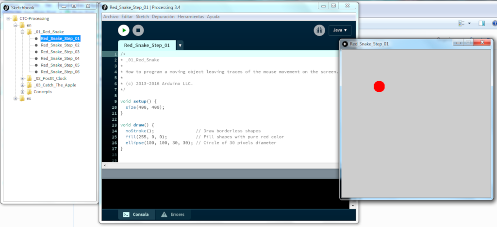
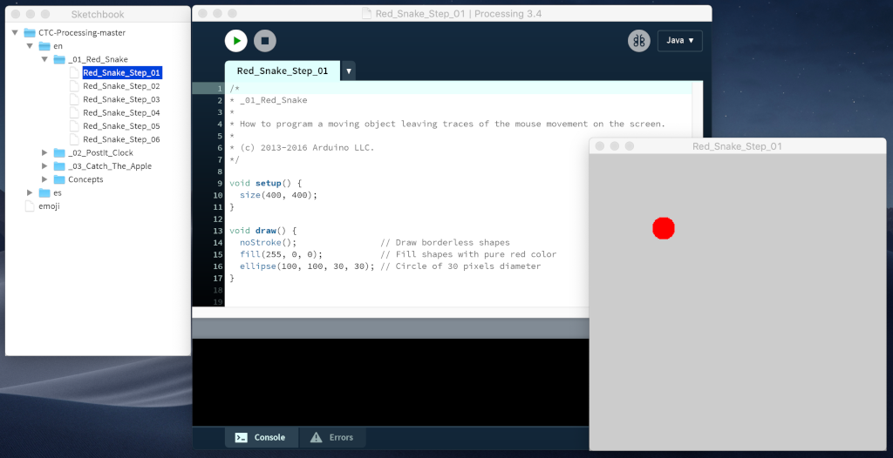
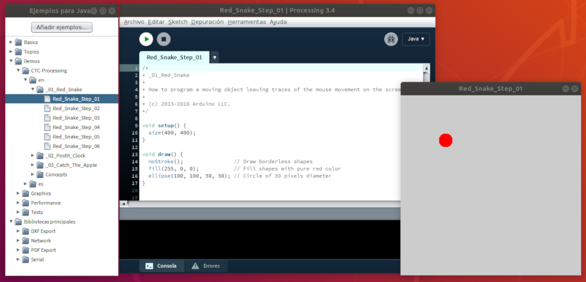

# Processing

> [Processing][1] es un lenguaje de programación con entorno de desarrollo integrado (IDE) de código abierto basado en Java. Se suele utilizar para la enseñanza y producción de proyectos multimedia e interactivos de diseño digital.

## Instalar Processing

La descarga de Processing 3 ocupa 126Mb aproximadamente. Al ser un lenguaje multiplataforma, dependiendo del sistema operativo utilizado deberás seguir unos pasos.

### Windows

1. Accede al apartado de [descargas][2] en la página oficial de Processing.
2. Descarga Processing dependiendo de si tu Sistema Operativo es de 32-bit o 64-bit.
    - Inicio / Ejecutar -> ``msinfo32.exe``.
    - Busca una línea que dice ``Equipo basado en``.
        - Si está basado en ``x86`` es de 32 bits.
        - Si está basado en ``x64`` es de 64 bits.
3. Descomprime el archivo con extensión ``.zip``.
4. Una vez descomprimido haz clic en ``processing.exe`` para empezar.

### Mac OS X

1. Accede al apartado de [descargas][2] en la página oficial de Processing.
2. Descarga Processing dependiendo de si tu Sistema Operativo es de 32-bit o 64-bit.
    - En la terminal ejecutar -> ``uname -a``.
    - Fíjate en la línea que aparece:
        - Si aparece ``RELEASE i386`` es de 32 bits.
        - Si aparece ``RELEASE x86_64`` es de 64 bits.
3. Descomprime el archivo con extensión ``.zip`` y arrástralo en la carpeta ``/Aplicaciones``.
4. Una vez descomprimido haz clic en ``processing.exe`` para empezar.

### Linux

1. Accede al apartado de [descargas][2] en la página oficial de Processing.
2. Descarga Processing dependiendo de si tu Sistema Operativo es de 32-bit o 64-bit.
    - En la terminal ejecutar -> ``uname -a``.
    - Fíjate en la línea que aparece:
        - Si aparece ``i386, i486, i586 o i686`` es de 32 bits.
        - Si aparece ``x86_64`` es de 64 bits.
3. Una vez descargado en tu carpeta local, abre una terminal, accede al directorio local con ``cd directorio`` y descomprime el ejecutable con la instrucción ``tar xvfz processing-xxxx.tgz``. Reemplaza el texto xxxx con el nombre del archivo que le sigue. 
4. Una vez descomprimido se habrá creado una carpeta llamada processing-3.4 o similar. 
5. Accede al directorio descoprimido con ``cd processing-xxxx`` y ejecuta el instalador con ``./install.sh``

## Añadir ejemplos de Processing

### Windows

1. Accede a los ejemplos [CTC - Processing][3] de GitHub y descarga el contenido en el botón "Download ZIP".
2. Descomprime la carpeta y añádela dentro de la carpeta ``processing-xxxx/`` donde la hayas descomprimido.
3. Accede a Processing y verás los ejemplos dentro del menú ``Archivo/Sketchbook``.

### Mac Os X

1. Accede a los ejemplos [CTC - Processing][3] de GitHub y descarga el contenido en el botón "Download ZIP".
2. Descomprime la carpeta y añádela dentro de la carpeta ``Aplicaciones/[usuario]/Processing``.
3. Accede a Processing y verás los ejemplos dentro del menú ``Archivo/Sketchbook``.

### Linux 

1. Accede a los ejemplos [CTC - Processing][3] de GitHub y descarga el contenido en el botón "Download ZIP".
2. Descomprime la carpeta y añádela dentro de la carpeta ``processing-xxxx/modes/java/examples/Demos``.
3. Accede a Processing y verás los ejemplos dentro del menú ``Archivo/Ejemplos/Demos``.

También puedes añadirla dentro de la carpeta ``processing-xxxx/Sketchbook`` y acceder desde el menú ``Archivo/Sketchbook``.

[1]: https://processing.org/
[2]: https://processing.org/download/
[3]: https://github.com/arduino/CTC-Processing